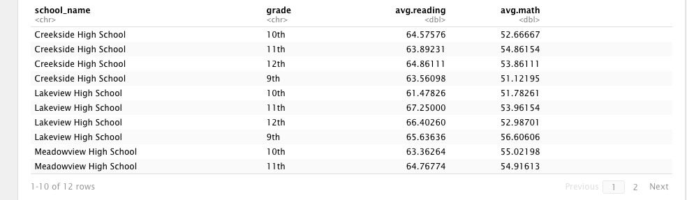
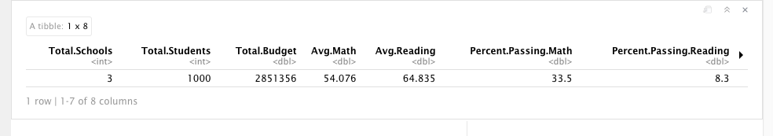

# School Tibble

In this activity, you’ll use a dataset similar to the one from your PySchools homework assignment, this time in R.

## Instructions

The instructions for this activity are divided into two parts.

### Part 1

* Using the data provided in [schools.csv](Resources/schools.csv) and [students.csv](Resources/students.csv), create a tibble with a summary of statistics for each school.

  

### Part 2

* If time allows, create a tibble with a district-wide summary of schools, as shown in the following image:

  

* Most of the calculations have already been performed for you in the RMD file; your task is to assemble a new tibble by using these calculated variables.

  The following information and their calculated values should be the summarized data in your new tibble:

  * School count: 3
  * Student count: 1000
  * Total budget: 2851356
  * Average reading score: 64.835
  * Average math score: 54.076
  * % passing reading: 33.5
  * % passing math: 8.3
  * Overall passing rate: 20.9

### Hints

* How to perform [a left join in R](https://stackoverflow.com/questions/37235759/how-to-do-left-join-in-r)

* How to [convert data types](
https://stackoverflow.com/questions/2288485/how-to-convert-a-data-frame-column-to-numeric-type)

## References

Mockaroo, LLC. (2021). Realistic Data Generator. [https://www.mockaroo.com/](https://www.mockaroo.com/)

- - -

© 2022 edX Boot Camps LLC. Confidential and Proprietary. All Rights Reserved.
